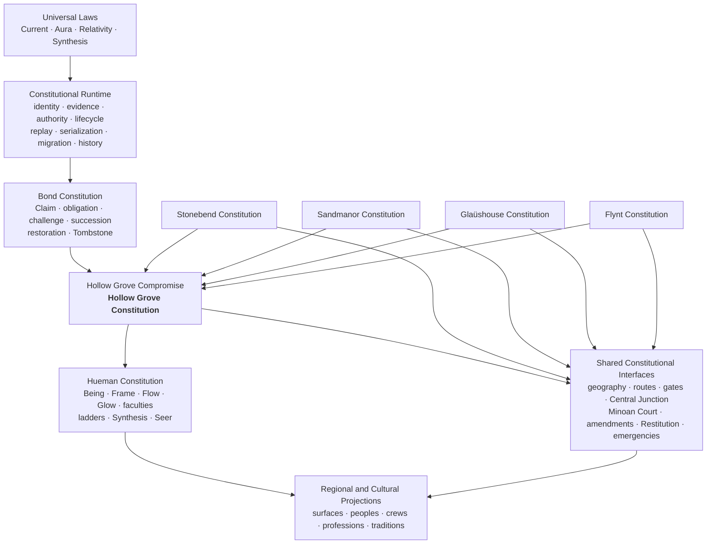
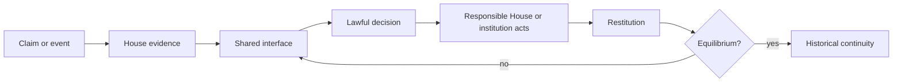

# Hollow Grove Constitutional Architecture V1

Date: 2026-07-26

Status: authoritative architecture and authority index

Authority: architecture of the Hollow Grove Compromise; this document does not
create a constitution, House, office, or runtime

## Constitutional identity

**The Hollow Grove Compromise is the Hollow Grove Constitution.**

Its stable repository source is
`HOLLOW_GROVE_COMPROMISE_V1_DRAFT.md`. The filename preserves provenance and
does not reduce its current authority.

> The Houses govern their domains. The Hollow Grove Compromise governs how
> those domains coexist.

The Compromise connects four and only four House constitutions: Stonebend,
Sandmanor, Glaüshouse, and Flynt. It is neither a fifth House nor a superior
sovereign. Shared agreement, interface law, and constitutional
interoperability do not absorb House authority.

## Architecture graph

Arrows into the Compromise mean participation in shared law, not subordination
to a central ruler.

## House-domain responsibility matrix

| House | Constitutional domain | Principal authorities | Evidence retained by House | Shared boundaries |
|---|---|---|---|---|
| Stonebend | Body/Presynce, Craft, Continuance of Form, Current, lawful Hollowing, Name, Claim, Title, provenance, boundary, material identity | Diamond/Hypergiant, High Freemason, distributed Proliteriate | Names, Claims, Titles, seals, measures, provenance, Hollowing and Yield | three gates, Court, Central Junction, amendments |
| Sandmanor | Soul, Prefog/Prefig, Design, reciprocity, formation, Minorians/Minoans, Farm/Beach/coast, guardian Synthesis | Sandman, guardian mantles, bounded joint stewards | Design, formation, reciprocity, teaching, Contest, coastal evidence | Aura Way, Court hosting, Central Junction, clinical compatibility |
| Glaüshouse | Mind/Precog, Repair, Continuance of Function, compatibility, consent, care, maintained Synthesis | Prima Donna and clinical ladder | consent, compatibility, clinical, Living Ledger, Recipe Ledger, recovery | Court, emergency transfer, Central Junction, House Synthesis |
| Flynt | Spirit/Resynce, Engineering, Function, persistence, deployment, infrastructure, Manticorp | Tross and bounded continuity authorities | operational, deployment, persistence, infrastructure and Manticorp records | Court, Stonebend gate, Central Junction, regional routes |

No House owns Current, Aura, Relativity, Synthesis, the shared Court, or the
Compromise.

## Shared-interface matrix

| Interface | Source authority | Shared decision or transfer | Responsible action | Historical verification |
|---|---|---|---|---|
| constitutional geography and routes | relevant Houses plus Compromise route law | typed route/boundary transfer | receiving House or route institution | shared interface archive and world replay |
| Stonebend gates | House evidence, Stonebend boundary records, Central Junction records | bounded gate disposition | Stonebend and receiving domain | gate event plus related Title history |
| Central Junction | House Sector Halls and market institutions | Board recognition, Exchange calculation, Clearing settlement, Wire publication | named Junction institution | shared interface record and public evidence |
| Service Tournament | four House constitutions under Compromise shared-Function law | nonlethal scenarios, War of a Thousand Hues, constitutional scoring, coequal Current/Aura prizes | each House within its own authority; bounded Tournament administration | versioned year archive, stable event/scenario/mark/Service Mark/prize/Synthesis provenance, checksum, and replay |
| Minoan County Court | House evidence and affected-party testimony | Conciliation, First Hearing, Appeal, Constitutional Review, Restitution | constitutionally responsible House/institution | Court archive, Restitution and recurrence |
| constitutional amendments | proposer, affected Houses, Court process review | scope-appropriate ratification | Houses implement; Stonebend seals | amendment archive and Restitution review |
| emergency transfer | Minoan/coastal legal authority and Glaüshouse clinical authority | lawful custody transfer and clinical acknowledgment | originating and receiving institutions | shared transfer history |
| cross-House compatibility | requesting House and Glaüshouse | compatibility decision without succession appropriation | requesting House assigns meaning/office | compatibility and maintenance evidence |

## Authority-source matrix

| System | Authoritative definition | Implementation | Executable witness | Projection or alias | Deprecated source |
|---|---|---|---|---|---|
| Hollow Grove Constitution | `HOLLOW_GROVE_COMPROMISE_V1_DRAFT.md` | composition of common runtime and shared adapters | whole integration audit | architecture, authority map, world context | former “active synthesis draft” status |
| Universal Laws | Compromise plus semantic foundation | root law and constitutional runtime | root constitutional tests | world context | no House-local ownership |
| Constitutional Runtime and Bond | `HOLLOW_GROVE_V2_CONSTITUTIONAL_SPECIFICATION.md` beneath Compromise | `src/constitutional/` | runtime/application/replay tests | trace and TUI | former claim to be top-level Constitution |
| Stonebend | `STONEBEND_CONSTITUTION_V2.md` and incorporated pass documents | `src/world/stonebend.rs` and children | Stonebend tests/audits | Stonebend roles | V1 redirect |
| Sandmanor | `SANDMANOR_CONSTITUTION_V2.md` and guardian/succession document | `src/world/sandmanor.rs` and milestone | Sandmanor tests/audit | Sandmanor roles | V1 redirect |
| Glaüshouse | `GLAUSHOUSE_CONSTITUTION_V2.md` | `src/world/glaushouse.rs` | Glaüshouse tests/audit | Glaüshouse roles | V1 redirect |
| Flynt | `FLYNT_CONSTITUTION_V2.md` and dual-leadership document | `officials-and-outlaws`, projected by `src/world/flynt.rs` | Flynt crate tests/audit | Flynt roles and stable aliases | Boardwalk draft where unratified |
| Hueman | `HUEMAN_v0.1.0.md` as entry point and its specialized authorities | Frame, progression, faculty, Recipe, Sympiote and Synthesis modules | Hueman/faculty/Recipe/Synthesis tests | Hueman artifacts | no House office |
| geography | `HOLLOW_GROVE_CONSTITUTIONAL_GEOGRAPHY_V2.md` | geography and route network | geography/route audits | maps and scenes | frozen token aliases |
| Central Junction | `CENTRAL_JUNCTION_FOUR_POLE_ECONOMY_V1.md` | `src/world/central_junction.rs` | Central Junction tests/audit | public boards/world context | no House exchange |
| Service Tournament | `SERVICE_TOURNAMENT_CENTRAL_JUNCTION_CANON_V1.md` and `SERVICE_TOURNAMENT_ARCHIVE_AND_CANONICAL_YEAR_FIXTURE_V1.md` under Compromise and House constitutions | `src/world/service_tournament.rs`, archive, fixture, and House Synthesis semantics | canon, archive, migration, replay, and audit tests | Central Junction Function record | no new constitution, service faction, sovereignty transfer, or kernel lore |
| Minoan Court | `MINOAN_COUNTY_COURT_SYSTEM_AND_RESTITUTION_CYCLE_V1.md` under Compromise | Court model plus shared interface archive | Court tests/audit | courthouse and scene projections | reserved appeal text |
| amendments and Restitution | Minoan Court document under Compromise | Court/shared interface adapters | amendment/Restitution tests | world context | no judicial ratification |

## Dependency matrix

Legend: **R** may reference; **A** must use a shared adapter; **—** must not
depend directly.

| From \ To | Universal laws/runtime | Bond | House domain | Shared interfaces | Regional projection |
|---|---:|---:|---:|---:|---:|
| Universal laws/runtime | R | R | — | — | — |
| Bond | R | R | — | — | — |
| House domain | R | R | R within same House | A | R |
| Shared interfaces | R | R | A | R | R |
| Regional projection | read-only | read-only | read-only | read-only | R |

House-to-House decisions use a Compromise-level adapter. A House may not import
another House's sovereign meaning as if it were local law. Generated
projections never feed authority back into authored law.

## Constitutional lifecycle map

The shared interface decides only within its constitutional boundary. The
responsible domain performs the remedy. Restitution verifies lived effect and
preserves recurrence under the same stable identity.

## Amendment lifecycle

Court certification is not ratification. Ratification is not Stonebend
sealing. House-local amendments use that House's process; cross-House
amendments require each affected House; foundational amendments require all
four Houses. Central Junction is not a fifth House.

## Completion-status matrix

| Layer | Status after reconciliation | Remaining explicit deferral |
|---|---|---|
| Universal Laws | complete in current scope | future product details |
| Constitutional Runtime | complete; one runtime | new domain payloads use adapters |
| Bond Constitution | complete; one grammar | no duplicate reducer |
| Stonebend | constitutionally integrated | courts/property/criminal detail |
| Sandmanor | constitutionally integrated | lived civic catalogs |
| Glaüshouse | constitutionally integrated | full Illegal Synthesis procedure |
| Flynt | constitutionally integrated | detailed administration and prosecution |
| Hueman | authoritative entry point established | unresolved ladder details explicitly retained |
| shared interfaces | implemented and persisted | staffing/formulas deferred |
| regional projections | synchronized | gameplay and art remain Phase 3 |

“Complete” here means constitutionally operable and integrated, not that every
future civic, legal, economic, or gameplay system is implemented. Final freeze
requires the separately authorized Constitutional Freeze and Phase 2 Closeout.
