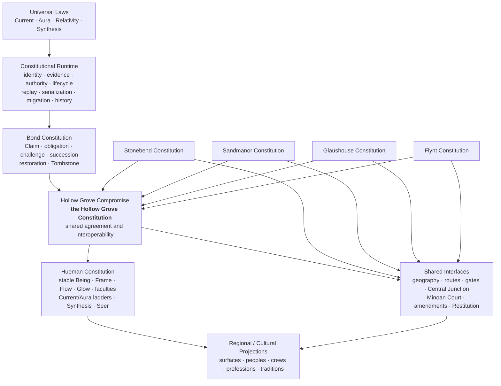

# Hollow Grove Whole Constitutional Integration Audit V1

Date: 2026-07-26

Status: read-only discovery audit; not constitutional law

Audit boundary: repository state after the Minoan County Court implementation
and before the Whole Constitutional Reconciliation and Freeze Pass

## 1. Executive conclusion

**Readiness judgment: NOT READY FOR CONSTITUTIONAL FREEZE.**

The repository contains one strong common Bond runtime and four identifiable
House constitutions. Stonebend, Sandmanor, and Glaüshouse have substantial
executable domain law. Flynt has a strong, deterministic identity and command
constitution. Constitutional geography, Central Junction, the Stonebend
foundation and offices, Sandmanor guardians, the Glaüshouse clinical ladder,
and the five-stage Minoan Court model all have deterministic local proofs.

They do **not yet form one fully coherent, replayable constitutional system**.
The blockers are architectural rather than gameplay defects:

1. `HOLLOW_GROVE_COMPROMISE_V1_DRAFT.md` is canonically the Hollow Grove
   Constitution according to the locked architecture, but the repository still
   labels it an active synthesis draft and says it cannot create authority.
   `HOLLOW_GROVE_V2_CONSTITUTIONAL_SPECIFICATION.md` simultaneously declares
   itself canonical, normative, and the primary architectural authority.
   `HOLLOW_GROVE_CORE_v1.0.0.md` also calls itself the active constitutional
   reference.
2. The shared Minoan County Court is implemented and tested locally but is not
   incorporated into the Compromise, authority map, capability surfaces,
   generated world context, or a shared replay/migration archive. Older
   Stonebend and capability text still directs or reserves appeals elsewhere.
3. The common runtime provides replay, serialization, migration, idempotence,
   and historical validation for Bond and regional Synthesis, but several later
   constitutional aggregates are deterministic validators rather than
   participants in that archive. Court cases, amendments, judicial
   Restitution, Central Junction transactions, and later Stonebend office
   lifecycles do not yet share one persistent constitutional envelope.
4. Flynt explicitly leaves Tross succession unspecified. A lawful new Tross,
   vacancy, removal, and return path are therefore unreachable.

No inspected evidence shows a fifth House, a Court sovereign, a Central
Junction House, a Regent, or a second recursion kernel. The implementation
still contains exactly four `House` variants. The central problem is not an
extra House; it is incomplete authority and history integration among otherwise
well-bounded systems.

This audit made no constitutional, runtime, projection, test, or gameplay
correction. It records the reconciliation boundary only.

## 2. Locked architecture

The Hollow Grove Constitution is the Hollow Grove Compromise. The V2
constitutional specification is properly understood as the detailed Bond and
runtime specification beneath that compact, not as a second shared
constitution. This is the target architecture; finding `CB-01` records that the
current repository labels do not yet express it.

The arrows into the Compromise mean agreement and interface participation, not
subordination to a fifth sovereign.

> The Houses govern their domains. The Hollow Grove Compromise governs how
> those domains coexist.

## 3. Audit method and inspection manifest

The audit used source inspection, repository-wide text search, executable
tests, audit binaries, byte comparison, and compilation. It did not mutate
constitutional state.

### 3.1 Authored sources directly opened or searched

- `HOLLOW_GROVE_COMPROMISE_V1_DRAFT.md`
- `HOLLOW_GROVE_V2_CONSTITUTIONAL_SPECIFICATION.md`
- `HOLLOW_GROVE_CORE_v1.0.0.md`
- `HOLLOW_GROVE_SEMANTIC_FOUNDATION_V1.md`
- `HOLLOW_GROVE_CONSTITUTIONAL_GEOGRAPHY_V2.md`
- `CURRENT_SYNTHESIS_HOLLOW_GROVE_WORLD_CONTEXT_v0.1.0.md`
- `REPOSITORY_AUTHORITY_MAP.md`
- `V2_CAPABILITY_INVENTORY.md`
- `V2_CAPABILITY_MATRIX.md`
- `HOLLOW_GROVE_V2_CAPABILITY_REPORT.md`
- `STONEBEND_CONSTITUTION_V1_DRAFT.md`
- `STONEBEND_CONSTITUTION_V2.md`
- `STONEBEND_AURA_WAY_AETHER_HOLLOWING_FOUNDATION_V1.md`
- `STONEBEND_THREE_GATES_OFFICES_AND_TITLE_SCOPE_V1.md`
- `STONEBEND_TITLE_LIFECYCLE_AND_CONSTITUTIONAL_CONTINUITY_V1.md`
- `SANDMANOR_CONSTITUTION_V1_DRAFT.md`
- `SANDMANOR_CONSTITUTION_V2.md`
- `SANDMANOR_GUARDIAN_AND_SUCCESSION_V1.md`
- `SANDMANOR_CONSTITUTIONAL_AUDIT_V2.md`
- `GLAUSHOUSE_CONSTITUTION_V1_DRAFT.md`
- `GLAUSHOUSE_CONSTITUTION_V2.md`
- `GLAUSHOUSE_CONSTITUTIONAL_AUDIT_V2.md`
- `FLYNT_CONSTITUTION_V2.md`
- `FLYNT_DUAL_LEADERSHIP_AND_MANTICORP_RECIPE_V1.md`
- `CENTRAL_JUNCTION_FOUR_POLE_ECONOMY_V1.md`
- `MINOAN_COUNTY_COURT_SYSTEM_AND_RESTITUTION_CYCLE_V1.md`
- `HUEMAN_v0.1.0.md`
- `HUEMAN_FACULTIES_V1.md`
- `HOLLOW_GROVE_POWER_RECIPE_CONSTITUTION_V1.md`
- `HOLLOW_GROVE_VISUAL_COLOR_CONSTITUTION.md`
- `artifacts/index.md`
- all Markdown projections under `artifacts/`, with direct attention to
  `current_synthesis_world_context.md`, `hueman_stonebend_roles.md`,
  `hueman_sandmanor_roles.md`, `hueman_glaushouse_roles.md`,
  `hueman_flynt_constitution.md`, `hueman_scene_presence.md`,
  `hueman_inverse_circle.md`, and `vertical_integration_stack.md`.

### 3.2 Implementation sources directly opened or searched

- `src/constitutional/*.rs`, especially `bond.rs`, `runtime.rs`, `model.rs`,
  `ids.rs`, `houses.rs`, `persistence.rs`, `regional.rs`,
  `regional_persistence.rs`, `scenarios.rs`, `trace.rs`, and `application.rs`
- `src/hollow_grove_contract.rs`
- `src/institution.rs`
- `src/frame_state.rs`
- `src/world/mod.rs`
- `src/world/stonebend.rs` and `src/world/stonebend/*.rs`
- `src/world/sandmanor.rs` and `src/world/sandmanor/*.rs`
- `src/world/glaushouse.rs`
- `src/world/flynt.rs` and `src/world/flynt/*.rs`
- `src/world/central_junction.rs`
- `src/world/minoan_court.rs`
- `src/world/geography.rs`
- `src/world/route_network.rs`
- `src/world/house_institutions.rs`
- `src/world/hueman_faculties.rs`
- `src/world/power_recipes.rs`
- `src/world/sympiote.rs`
- `src/world/lived_lore.rs`
- `src/world/persistence.rs`
- `src/gameplay/*.rs`
- `officials-and-outlaws/src/lib.rs`
- `hollow-grove-kernel/src/lib.rs`

### 3.3 Executable witnesses inspected or run

All files under `tests/`, all three Flynt test targets under
`officials-and-outlaws/tests/`, the kernel test target, and these 16 audit
binaries:

- `aura_field_audit`
- `aura_surfaces_audit`
- `central_junction_constitutional_audit`
- `constitutional_geography_audit`
- `deep_pressure_audit`
- `flynt_constitutional_audit`
- `glaushouse_constitutional_audit`
- `hollow_grove_functional_lore_audit`
- `hollow_grove_route_network_audit`
- `living_world_audit`
- `party_recruitment_audit`
- `sandmanor_constitutional_audit`
- `stonebend_constitutional_audit`
- `stonebend_three_gates_audit`
- `stonebend_title_lifecycle_audit`
- `visual_color_constitution`

There is no Minoan Court audit binary and no whole-integration audit binary in
the inspected state.

### 3.4 Files changed by this audit

- `HOLLOW_GROVE_WHOLE_CONSTITUTIONAL_INTEGRATION_AUDIT_V1.md` — added as the
  sole audit deliverable.

No executable test, audit binary, authored constitution, implementation source,
or generated projection was added or changed by this audit.

## 4. Authority-source matrix

| System | Intended authoritative definition | Implementation | Executable witness | Projection | Audit disposition |
|---|---|---|---|---|---|
| Hollow Grove Constitution | `HOLLOW_GROVE_COMPROMISE_V1_DRAFT.md` | composed interfaces; no separate sovereign runtime | distributed | world/context and architecture surfaces | ownership locked by instruction but repository status conflicts |
| Universal Laws | Compromise foundation, `HOLLOW_GROVE_SEMANTIC_FOUNDATION_V1.md`, and world context | root contracts and runtime primitives | root tests and functional-lore audits | world context | definitions are fragmented; no House owns them |
| Constitutional Runtime | V2 runtime clauses, subordinate to Compromise | `src/constitutional/` | constitutional runtime/application tests | traces/TUI | complete for Bond and regional Synthesis |
| Bond Constitution | V2 Bond specification | `bond.rs`, `runtime.rs`, `persistence.rs` | runtime, demonstration, application tests | trace/TUI | complete |
| Stonebend Constitution | `STONEBEND_CONSTITUTION_V2.md` plus incorporated three pass documents | `src/world/stonebend.rs` and children | Stonebend tests and 3 audits | role/world projections | locally mature; shared Court conflict |
| Sandmanor Constitution | `SANDMANOR_CONSTITUTION_V2.md` plus guardian document | `src/world/sandmanor.rs` and milestone | Sandmanor tests and audit | role/world projections | locally mature; shared Court/Restitution adapter missing |
| Glaüshouse Constitution | `GLAUSHOUSE_CONSTITUTION_V2.md` | `src/world/glaushouse.rs` | Glaüshouse tests and audit | role/world projections | clinical domain mature; civic continuity and Court adapter incomplete |
| Flynt Constitution | `FLYNT_CONSTITUTION_V2.md` plus dual-leadership document | `officials-and-outlaws`, projected by `src/world/flynt.rs` | 16 Flynt tests and audit | Flynt role projection | identity/hierarchy complete; succession and review deferred |
| Hueman Constitution | no single source; Compromise, `HUEMAN_v0.1.0.md`, faculty, progression, Recipe, and Synthesis documents share it | Frame/progression/faculty/Recipe modules | faculty, progression, Recipe, Synthesis tests | numerous Hueman projections | authority fragmented |
| Constitutional geography | `HOLLOW_GROVE_CONSTITUTIONAL_GEOGRAPHY_V2.md` | geography and route network | geography and route audits/tests | map/scene projections | complete in bounded scope |
| Central Junction | `CENTRAL_JUNCTION_FOUR_POLE_ECONOMY_V1.md` | `src/world/central_junction.rs` | 27 original milestone tests plus audit | world/role boards | domain logic complete; common archive adapter absent |
| Minoan County Court | `MINOAN_COUNTY_COURT_SYSTEM_AND_RESTITUTION_CYCLE_V1.md` | `src/world/minoan_court.rs` | 33 tests; no audit binary | courthouse projection only | structurally implemented, not authority/runtime integrated |
| Amendment procedure | Court document under the Compromise | Court amendment records | Court tests | none authoritative | in-memory proof only |
| Judicial Restitution | Court document under the Compromise | Court remedy/Restitution records | Court tests | none authoritative | in-memory proof only |
| Regional Synthesis | Compromise/House law plus regional Synthesis source | regional reducer and persistence | regional tests | world/House roles | common runtime complete for ratified lineages |

Historical V1 House drafts are correctly marked as redirects and are not active
duplicates. Generated artifacts are correctly described as projections in the
authority map, but several are stale or semantically misleading.

## 5. Four-House completion matrix

| Dimension | Stonebend | Sandmanor | Glaüshouse | Flynt |
|---|---|---|---|---|
| Domain | Name, Claim, Title, Form continuity, material identity, Hollowing, gates | Design, reciprocity, formation, Soul, Farm/Beach/coast | clinical repair, consent, compatibility, maintained Synthesis, Mind | Function, engineering, persistence, deployment, Spirit |
| People/regions | Geralds; Stonebend; three gates; Lazerhorn path | Minorians/Minoans; Farm, Fields, Content Farm, Beach, Current Break | Nightingales and clinical ranks; Glauspitals; Glaüshouse | Basin founding peoples, Manticorp, Gallows/Gallowry |
| Principal offices | Diamond/Hypergiant; High Freemason; distributed Proliteriate | singular Sandman; guardian mantles; joint vacancy stewards in canon | singular Prima Donna; Persephone, Matron, Marshal, Nightingale structure | singular Tross; Chimera is companion, not office |
| Acquisition | typed Title and office sequences | typed Contest, guardian Recipes, sovereign convergence | typed twelve-stage clinical selection | current Tross identity is locked; future acquisition absent |
| Maintenance | typed maintenance/renewal and bounded intervention | maintained guardian/Sandman Synthesis; proof renewal concepts | strong clinical Continuance and renewal | maintained Manticorp Form is documented |
| Challenge/removal | one-challenge/two-remove and targeted lifecycle | Contest challenges and removal grounds; shared Court link absent | independent review/removal grounds; shared Court link absent | no complete challenge/removal procedure |
| Succession/vacancy | Lazerhorn path, Diamond vacancy, Forge replacement, Proliteriate continuity | Contest succession; joint interim governance is primarily documentary | accession sequence exists; full vacancy/restoration continuity is incomplete | explicitly unspecified and unreachable |
| Evidence | seals, provenance, Claim/Title/Yield, gate evidence | Design, reciprocity, baselines, teaching, crowd evidence | consent, clinical, compatibility, Living/Recipe Ledgers | operational and Proof of Persistence evidence |
| Signature crime | Illegal Hollowing | Fraudulent Design | Illegal Synthesis | no equivalently complete signature-crime procedure |
| Emergency authority | typed bounded Diamond continuity | narrow joint interim/emergency canon | emergency care authority is bounded clinically | major deployment authority exists; constitutional vacancy emergency path absent |
| Shared interfaces | gates, Central Junction, Court evidence | Aura Way, Court host, Central Junction Design | emergency transfer, Court evidence, Central Junction Repair | gates, routes, Central Junction Engineering, Court evidence |
| Court jurisdiction | typed in Court, contradicted by old House appeal text | typed in Court, House appeals not routed | typed in Court, House appeals not routed | typed in Court, no House review adapter |
| Remedies/Restitution | precise lifecycle interventions; judicial execution adapter absent | rich remedies; no judicial Restitution adapter | care/repair remedies; no judicial Restitution adapter | technical remedy types only in Court |
| Historical record | strong Tombstones locally | failures/proof history and guardian replay; uneven office archive | clinical ledgers and evidence; no common office archive | deterministic catalog; no succession Tombstones |
| Completion judgment | **structurally complete, not cross-House integrated** | **structurally complete, not cross-House integrated** | **clinical constitution complete; civic continuity not fully integrated** | **identity/hierarchy complete; constitution incomplete by explicit deferral** |

No House should be called wholly complete at the Hollow Grove level until its
Court, Restitution, replay, and cross-House evidence boundary is executable.

## 6. Shared-interface matrix

| Interface | Stable identity/source | Receiver/decision | Rejection | Remedy/Restitution | Replay/migration/history | Status |
|---|---|---|---|---|---|---|
| Ten cross-House routes | stable route and boundary IDs; House endpoints | route/boundary process | typed geography validation | gameplay/world action routes to domain | gameplay archive covers route events | complete |
| Three Stonebend gates | stable facing and gate IDs; House/CJ evidence | Stonebend bounded review | independent scope rejection/limitation | targeted scope actions | deterministic tests; no common archive adapter | structurally complete |
| Central Junction | stable enterprise/project/contract IDs and House attestations | Junction Board, Exchange, Clearing House, Wire | conflict and evidence rejection | settlement/publication | deterministic fixture; no shared replay/migration adapter | structurally complete |
| Minoan Court | stable case, party, evidence, stage, order, remedy IDs | one Court with typed jurisdictions | typed standing/stage/authority rejection | responsible institution plus Restitution | stage history in memory; no codec/replay/migration/idempotence | integration error |
| Cross-House evidence | source enum retains House or Junction source | Court compares evidence; House retains domain | source/jurisdiction mismatch rejected | Court targets responsible institution | no shared persisted evidence envelope across all Houses | integration error |
| Appeal | Court model exists | Court appellate stage | typed grounds/dispositions | remand/modified remedy | no common archive; old capability docs say unavailable | contradictory |
| Constitutional Review | Court model blocks ratification/sovereignty | Court reviews higher-law boundary | typed dispositions | return/narrow/stay | no shared archive | structurally complete |
| Judicial Restitution | stable remedy and Restitution IDs | responsible institution performs; Court verifies | recurrence reason required | equilibrium or same-case return | in-memory history only | integration error |
| Amendment/ratification | stable proposal and stage records | House-local, affected Houses, or all four | insufficient assent rejected | Stonebend seal then implementation Restitution | in-memory proof only | integration error |
| Emergency transfer | courthouse/coast/Glaüshouse canon and institutional IDs | Minoan law transfers; Glaüshouse treats | domain boundary documented | clinical action | no shared transfer aggregate found | missing interface |
| Diamond vacancy | stable Diamond/tenure/mandate IDs | bounded continuity only | sovereign actions rejected | succession/Tombstone | deterministic local history, no shared archive adapter | locally complete |

## 7. Cross-House evidence matrix

| Evidence | Source authority | Shared recipient | Decision boundary | Remedy performer | Restitution witness |
|---|---|---|---|---|---|
| Name, Claim, Title, seal, provenance, Hollowing | Stonebend | Court, gates, Central Junction | Court determines crossing; Stonebend retains record authority | Stonebend/Freemason/authorized gate institution | Court plus affected Yield evidence |
| Design, reciprocity, formation, Contest, coastal duty | Sandmanor | Court, Sandmanor-facing gate, Junction Design interface | Court cannot fabricate Proof of Reciprocity | Sandmanor institutions | Court and affected parties/nodes |
| engineering, deployment, persistence, infrastructure | Flynt | Court, Flynt-facing gate, Junction Engineering interface | Court/Stonebend cannot invent Proof of Persistence | Flynt/Manticorp within lawful scope | Court and burden-bearing nodes |
| consent, compatibility, care, maintained Synthesis | Glaüshouse | Court, transfer interfaces, Junction Repair interface | Court cannot decide clinical viability without Glaüshouse evidence | Glaüshouse clinical institutions | Court, patient, and affected community |
| prices, transactions, measures, settlement, publication | Central Junction institutions | Court and Stonebend circulation gate | Court does not calculate index or clear trade | Board/Exchange/Clearing House/Wire by role | Court verifies correction reached public record |
| public Yield and burden | affected people and Proliteriate nodes | Court and constitutional review | witness does not become sovereign | responsible House/institution | Proliteriate testimony plus Court equilibrium review |

The type model preserves evidence source in Court cases. The missing piece is a
shared persistent evidence-transfer envelope linking these records to each
House aggregate and back through Restitution.

## 8. Lifecycle reachability matrix

| Lifecycle | Entry reachable | Terminal reachable | Identity/history | Bypass protection | Finding |
|---|---:|---:|---|---|---|
| Ordinary Bond | yes | yes | append-only replay, codecs, migration, Tombstone | strong | complete |
| Stonebend Title | yes | yes | stable core, interventions, restoration, Tombstone | semantic stage order | locally complete |
| Hypergiant succession | yes | yes | Diamond survives tenure; Tombstone | Lazerhorn and no inheritance | locally complete |
| High Freemason replacement | yes | yes | old tenure Tombstone; one active seal | independent review/no self-certification | locally complete |
| Proliteriate continuity | yes | yes for mandate, network persists | mandate history retained | witness bounded/recallable | locally complete |
| Sandman succession | yes | yes | stable candidates, Contest, retained loser | order independent/no automatic winner | complete for accession; vacancy integration partial |
| Tross succession | **no** | **no** | current identity stable only | invented routes rejected | intentionally deferred; House incomplete |
| Glaüshouse clinical leadership | yes | removal grounds documented | clinical evidence stable | outgoing leader cannot appoint alone | vacancy/restoration common history incomplete |
| Court five-stage cycle | yes | yes after Restitution | one stable case, recurrence history in memory | semantic order and closure guards | no archive/replay/migration |
| House-local amendment | yes | yes through implementation review | stable proposal in memory | Court cannot ratify | no archive/institution adapter |
| Cross-House amendment | yes | yes in proof | affected House assent required | one House insufficient | no archive/institution adapter |
| Foundational amendment | yes | yes in proof | all-four record in memory | Court/CJ/single office insufficient | no archive/institution adapter |
| Restitution recurrence | yes | yes | same case identity; failed attempt retained in memory | reason and earlier stage required | no persisted recurrence proof |
| Diamond vacancy | yes | succession exit yes | Diamond stable; tenure Tombstone | no Regent/Acting Diamond | locally complete |
| emergency continuity | yes | termination required | bounded action record | cannot inherit Diamond | locally complete |
| restoration after interruption | yes | yes | stable Title plus preserved break | removed Hypergiant cannot shortcut | locally complete |

No impossible state was found in the common Bond reducer, Stonebend Title
lifecycle, guardian Contest, or Court stage reducer. The principal unreachable
constitutional state is lawful Tross replacement. The principal unpreserved
states are cross-interface Court, amendment, and Restitution histories after
process exit.

## 9. Authority-leak and self-review audit

### Controls that hold

- `House` has exactly Stonebend, Sandmanor, Glaüshouse, and Flynt.
- Central Junction facings and Court jurisdiction return no House endpoint for
  Central Junction.
- The Court model cannot bear Diamond, forge a Claim, ratify an amendment,
  execute its own remedy, remove a principal power alone, or fabricate
  House-domain evidence.
- Stonebend cannot fabricate Proof of Persistence or Sandmanor formation
  evidence.
- High Freemason self-certification and outgoing unilateral replacement are
  rejected.
- Hypergiant succession cannot bypass Lazerhorn or become automatic
  inheritance.
- A Proliteriate witness cannot expand a mandate or become a fourth sovereign.
- Glaüshouse compatibility remains clinical evidence rather than ownership of
  Sandmanor succession.
- Generated artifacts are designated as projections rather than normative law.

### Leaks or circular risks

- Stonebend Article XVI still routes ordinary disputes through the
  Proliteriate and high appeals to the Hypergiant. For disputes involving the
  Hypergiant or Diamond boundaries, this can collapse adjudication into
  executive self-review unless superseded by the shared Court boundary.
- Flynt makes all public and underground authority terminate at Tross but has
  no independent challenge, removal, vacancy, or succession route. The Court
  can find a boundary crossing, but no Flynt constitutional process can yet
  terminate or replace the authority.
- The neutral institution record still carries `house: Some(Sandmanor)` for the
  Minoan County Courthouse. `HostedBy` now records the Minoan relationship, but
  the generic `house` field does not distinguish territorial host from
  constitutional ownership. Projections still call the courthouse a
  “Sandmanor institution.”
- `src/constitutional/regional.rs` imports world institution identities. This
  is a practical adapter but reverses the ideal runtime-to-world dependency and
  should be isolated as a Compromise-level adapter during reconciliation.
- Sandmanor guardian Synthesis directly imports Glaüshouse maintained-Synthesis
  types. The authority boundary is validated, but the coupling should be made
  an explicit cross-House compatibility interface rather than an implicit
  House-to-House dependency.

## 10. Contradiction register

| ID | Severity | Contradiction | Evidence | Required reconciliation |
|---|---|---|---|---|
| CB-01 | Constitutional Blocker | Three documents claim top shared constitutional posture | Compromise says active synthesis draft; V2 spec says canonical/normative/primary; Core says active constitutional reference | declare Compromise the Constitution; subordinate V2 to Bond/runtime; reclassify Core as architecture/product context |
| XI-01 | Cross-House Integration Error | Shared Court exists in code/doc but is absent from Compromise and authority map | Court source/tests versus Compromise stopping at Stonebend Third Pass | incorporate Court as a Compromise interface without making a new constitution |
| XI-02 | Cross-House Integration Error | Stonebend appeals terminate at Proliteriate/Hypergiant rather than shared Court | `STONEBEND_CONSTITUTION_V2.md` Article XVI | retain House evidence and enforcement while routing adjudication to Court |
| DA-01 | Documentation Authority Error | Capability surfaces say appeal is always reserved/unavailable | capability matrix, inventory, and report | update only after Court authority is reconciled |
| PD-01 | Projection Drift | Current Seanad is described as an institutional “water court” | scene/inverse projections | distinguish deliberative Seanad from judiciary |
| XI-03 | Cross-House Integration Error | Court host and law ownership share one ambiguous `house` field | neutral institution record and Sandmanor projection | model host separately from domain ownership |
| XI-04 | Cross-House Integration Error | House-local appeals/remedies are not connected to shared Court enforcement and Restitution | House constitutions versus Court model | add typed adapters, not duplicate courts |
| RT-01 | Runtime or Determinism Error | Court/amendment/Restitution lack codec, replay, migration, and idempotent command boundary | no such API in `minoan_court.rs` or world persistence | add a common-runtime adapter/archive |
| RT-02 | Runtime or Determinism Error | Central Junction and later Stonebend constitutional records are not in one shared archive | deterministic tests exist; no aggregate codec found | define shared interface event envelopes |
| HL-01 | House-Local Error | Tross succession, vacancy, removal, and lawful return are unspecified | Flynt Constitution explicit deferral | define Flynt continuity in a later authorized pass |
| HL-02 | House-Local Error | Glaüshouse leadership removal grounds exist, but full vacancy/restoration/Tombstone process is not executable | V2 accession law and current model | complete civic office continuity without changing clinical ladder |
| HL-03 | House-Local Error | Sandmanor joint interim governance and Sandman removal are more documentary than runtime-integrated | Articles VIII–IX versus milestone model | add bounded office continuity adapter |
| HL-04 | House-Local Error | Stonebend Article VI says institution nominates, Proliteriate reviews, Hypergiant confirms, while Third Pass requires independent replacement review | Stonebend V2 versus Third Pass | distinguish ordinary evidence roles from independent constitutional certification |
| DA-02 | Documentation Authority Error | No single constitutional architecture document exists | repository inventory | create/update architecture source during reconciliation, not a new constitution |
| DA-03 | Documentation Authority Error | Hueman constitutional authority is fragmented across several documents | Compromise, Hueman, faculties, progression, Recipe, semantic sources | name one authority entry point and classify the others |
| XI-05 | Cross-House Integration Error | Emergency courthouse-to-Glaüshouse transfer is canonical but lacks a persistent shared transfer record | Sandmanor/Court documents and institution projection | add transfer evidence and Restitution linkage |
| XI-06 | Cross-House Integration Error | House-specific and institutional identity wrappers lack a documented cross-system identity map | shared and per-House stable ID types | define adapters; do not collapse legitimate domain IDs |
| XI-07 | Cross-House Integration Error | Current world context locks House rocks while Stonebend foundation reports no final House-to-stone assignment | `HouseRock`, world context, Stonebend foundation audit | determine whether House rocks are symbolic/product aliases or mineral law |

## 11. Duplicate-authority register

| Subject | Apparent authorities | Assessment |
|---|---|---|
| Hollow Grove Constitution | Compromise, V2 constitutional specification, Hollow Grove Core | real duplicate top-level posture; blocker |
| Bond/runtime | V2 specification and `src/constitutional/` | legitimate specification/implementation pair once subordinated to Compromise |
| House V1/V2 documents | V1 redirects and V2 sources | no duplicate; redirects are correctly non-authoritative |
| Flynt | V2 document, dual-leadership document, officials crate, world projection | legitimate layered authority if the crate remains sole executable source |
| Stonebend passes | V2 constitution plus three incorporated pass documents | legitimate specialization, not three constitutions |
| Hueman | Hueman root, faculties, semantic, progression, Recipe, Synthesis sources | unclear root authority; documentation consolidation required |
| Judiciary | Minoan Court versus Current Seanad “court” projection | one legal Court plus one misleading cultural metaphor; clarify |
| Diamond | sovereign Title and stone/material term | intentional homonym, but House-stone mapping remains unresolved |

No second universal reducer was found. The Court case lifecycle and Stonebend
Title lifecycle are bounded domain lifecycles, not replacements for Bond.

## 12. Missing-interface register

| ID | Severity | Missing interface |
|---|---|---|
| MI-01 | Constitutional Blocker | authoritative Compromise-to-House/shared-interface dependency map |
| MI-02 | Runtime or Determinism Error | Court case archive, replay, migration, idempotence, and failure report |
| MI-03 | Cross-House Integration Error | Court judgment adapters to Stonebend, Sandmanor, Glaüshouse, Flynt, and Central Junction |
| MI-04 | Runtime or Determinism Error | amendment proposal/ratification/seal/implementation archive |
| MI-05 | Runtime or Determinism Error | Restitution delivery/recurrence archive tied to original case identity |
| MI-06 | House-Local Error | Flynt/Tross removal, vacancy, succession, Tombstone, and restoration |
| MI-07 | Cross-House Integration Error | courthouse emergency transfer evidence and receiving clinical acknowledgment |
| MI-08 | Documentation Authority Error | one named Hueman constitutional entry point |
| MI-09 | Cross-House Integration Error | common evidence envelope for House-authenticated expert records |
| MI-10 | Documentation Authority Error | executable Minoan Court audit and whole-integration audit |
| MI-11 | Cross-House Integration Error | shared identity adapters among participant, institutional, regional, House, case, and person IDs |
| MI-12 | Cross-House Integration Error | explicit historical link from interface failure back to each affected House aggregate |

## 13. Terminology-collision register

| Term | Uses | Judgment |
|---|---|---|
| Constitution | Compromise, V2 specification, House constitutions, additive “constitution” docs | top-level collision is not intentional; domain constitutions are intentional |
| Compromise | shared constitutional compact and current “synthesis draft” | status collision must be corrected |
| House / Kingdom | canonical `House` versus older “Four Kingdoms” language | likely compatibility alias; must be documented |
| Claim | Bond assertion, Stonebend constitutional Claim, Court claim | intentional specialization if provenance remains explicit |
| Title | generic bounded public identity, Stonebend Title core, office/title language | intentional; target layer must be explicit |
| Yield | Stonebend constitutional consequence and broader public result | intentional shared concept, but Court linkage incomplete |
| Recognition | Flynt constitutional act, Stonebend Title recognition, Court recognition, market recognition | intentional overload requiring qualified names |
| Restoration | Title repair, clinical restoration, institutional restoration | intentional domain action |
| Restitution | judicial remedy verification and occasional ordinary-language return | reserve capitalized form for Court stage |
| Tombstone | Bond and office historical record | shared grammar with domain adapters; no collision |
| Current | universal medium, ordinary product language, Current Haze/Sea/Seanad names | intentional family; Current Haze is not market state authority |
| Aura | universal manifestation, Aura Ridge/Way/Beach/Fields | intentional universal-to-regional projection |
| Aether | universal lightened Current and Mt. Aura ideal | intentional metaphysical/material pairing |
| Hollowing | material refinement and constitutional removal metaphor | distinguish material process from review of an unsupported Claim |
| Synthesis | shared transformation grammar and House-maintained regional forms | intentional specialization |
| Design/Form/Function | universal work classification and House domains | intentional Four-Pole grammar |
| Witness | evidence witness, Proliteriate temporary witness, public witness route | intentional roles with distinct authority |
| Court | Minoan County Court and Current Seanad “water court” | non-intentional projection collision |
| Diamond | Stonebend sovereign Title and stone term | intentional rhetoric; material mapping status unresolved |
| Equilibrium | Court closure and broader balance language | capitalized judicial result should remain typed |

Canonical terms should not be renamed merely to make them uniform. The
reconciliation pass should add qualifiers and authority references where the
same word lawfully operates at multiple layers.

## 14. Runtime-conformance results

| System | Caller ID | canonical order | replay | serialization | migration | idempotence | historical link |
|---|---:|---:|---:|---:|---:|---:|---:|
| Bond runtime | yes | yes | yes | yes | yes | yes | yes |
| regional Synthesis runtime | yes | yes | yes | yes | yes | yes | yes |
| gameplay/world event archive | yes | yes | yes | yes | schema migration | yes | yes |
| power Recipe/Sympiote | yes | yes | yes | yes | bounded migration | yes | yes |
| Sandmanor guardian events | yes | yes | replay function | no common archive found | no | bounded | in-memory |
| Stonebend foundation | yes | yes | deterministic reconstruction tests | no common archive found | no | not exposed | in-memory |
| Stonebend offices/Title lifecycle | yes | yes | semantic deterministic tests | no common archive found | no | not exposed | in-memory/Tombstone |
| Central Junction | yes | sorted/weighted semantics | deterministic proof only | no | no | not exposed | in-memory |
| Glaüshouse aggregate | yes | ordered selection | deterministic validation | no common archive found | no | not exposed | in-memory/ledgers |
| Flynt aggregate | yes | insertion independent | deterministic validation | no constitutional succession archive | no | not exposed | catalog only |
| Minoan Court | yes | yes | **no runtime replay** | **no** | **no** | **no command boundary** | in-memory stage history |
| amendments/Restitution | yes | yes | **no runtime replay** | **no** | **no** | not exposed | in-memory case link |

Domain structs do not need independent universal engines. They do need adapters
to the one existing runtime if their authoritative history must survive process
exit. Adding those adapters is preferable to creating new reducers.

The root test suite includes passing replay, migration, stable-identity,
lifecycle, amendment, Restitution, gate-scope, challenge, succession, and
Tombstone tests. These tests prove their current bounded targets; they do not
prove that every later world aggregate is archived.

## 15. Documentation and projection mismatches

1. The authority map calls the Compromise a non-authoritative active synthesis
   draft and directs readers to the V2 specification as normative law. This
   contradicts the locked architecture.
2. The capability matrix, inventory, and report still state that House appeal
   is an always-failing reserved procedure. Production now returns a Court
   referral and the Court model exists.
3. The world context and its generated mirror are byte-identical, but neither
   projects the new shared Court and Restitution cycle. Mirror equality proves
   faithful mirroring, not current constitutional coverage.
4. Scene projections call Current Seanad an institutional “water court,”
   obscuring the single-judiciary rule.
5. The Sandmanor role projection says the Minoan County Courthouse “remains a
   Sandmanor institution.” The canonical distinction is Minoan hosting without
   ownership of all law.
6. The Stonebend V2 civil-dispute article predates the shared Court and gives
   appellate work to Stonebend powers.
7. `HOLLOW_GROVE_CORE_v1.0.0.md` calls itself the active constitutional
   reference and uses “Four Kingdoms,” while the locked architecture uses the
   Compromise and four House constitutions.
8. `HouseRock` and the world context retain Diamond/Crystal/Jade/Opal House
   assignments while the First Stonebend Pass explicitly avoided locking a
   final House-to-stone mineral map.
9. No `HOLLOW_GROVE_CONSTITUTIONAL_ARCHITECTURE_V1.md` exists, so the
   architecture cannot currently be discovered from one authoritative
   repository document.
10. The Court document and tests are not listed in the authority map,
    capability inventory/matrix, or artifact index.

Generated files did not override authored authority. Their problem is drift,
not usurpation.

## 16. Severity summary

| Severity | Count | Freeze effect |
|---|---:|---|
| Constitutional Blocker | 2 | prevents freeze |
| Cross-House Integration Error | 9 | prevents whole-system freeze |
| House-Local Error | 4 | prevents affected House completeness |
| Runtime or Determinism Error | 4 | prevents durable shared operation |
| Documentation Authority Error | 4 | prevents reliable authority discovery |
| Projection Drift | 2 | misleads clients; does not alone alter law |
| Deferred Design | multiple bounded subjects | acceptable where explicitly deferred |
| Nonblocking Editorial Issue | terminology qualifiers and old “Kingdom” wording | clean up after authority is fixed |

The two constitutional blockers are: (1) top-level authority conflict and
(2) the absent authoritative architecture/interface map represented by
`MI-01`. Counts group related entries in the registers; they are not a count of
every textual occurrence.

## 17. Constitutionally complete systems

Complete within their ratified scope:

- common deterministic Bond runtime and lifecycle;
- regional Synthesis runtime for ratified lineages;
- four-value `House` identity with no fifth House;
- constitutional geography and ten route identities;
- Central Junction economic classification and deterministic market proof;
- Stonebend First Pass material continuum;
- Stonebend three gates, Diamond bearer distinction, challenge/removal,
  Lazerhorn succession, and Title lifecycle;
- Sandmanor guardian Recipe paths and Contest of Improvement;
- Glaüshouse clinical ladder, consent, compatibility, and maintained Synthesis;
- Flynt Tross/Mystery Man/Mr. X identity, command hierarchy, Chimera, and
  Manticorp distinction;
- Hueman Frame identity across existing transformation tests;
- Minoan Court five-stage logic, targeted remedies, amendment-scope logic, and
  same-case Restitution recurrence **in memory**.

## 18. Structurally complete but not integrated

- Minoan Court case lifecycle;
- judicial Restitution and equilibrium;
- House-local, cross-House, and foundational amendment proofs;
- Court-to-House remedy routing;
- Central Junction constitutional records;
- later Stonebend office and Title records;
- Sandmanor and Glaüshouse office continuity;
- Hueman constitutional authority map;
- cross-House identity and evidence adapters.

## 19. Intentionally deferred

- complete criminal codes and prosecution;
- full Illegal Hollowing and Illegal Synthesis procedure;
- property, inheritance, custody, taxation, public finance, and compensation
  formulas;
- court staffing, permanent judicial selection, numerical thresholds, juries,
  policing, sentencing, and prisons;
- complete ordinary Title catalogs;
- complete regional civic catalogs and lived culture;
- final House stone assignments and synthetic mineral/product systems;
- detailed Lazerhorn gameplay.

Tross succession is also explicitly deferred in current Flynt canon, but unlike
the subjects above it prevents Flynt from satisfying this audit's required
authority-failure and continuity test. It must be resolved before whole-level
freeze.

## 20. Exact recommended correction order

1. **Freeze authority posture first.** Amend the Compromise status and authority
   section to state that it is the Hollow Grove Constitution. Reclassify the V2
   constitutional specification as the normative Bond/runtime specification
   under the Compromise. Reclassify Core as product/system architecture.
2. **Publish the locked architecture.** Create or update the single
   architecture document and rewrite the repository authority map around the
   Compromise → common runtime/Bond → four Houses/shared interfaces structure.
3. **Reconcile the judiciary.** Incorporate the Minoan Court document into the
   Compromise; supersede Stonebend executive appeal language; route each House's
   domain evidence and remedies without transferring domain ownership.
4. **Establish one shared interface event envelope.** Reuse common stable IDs,
   evidence, sequence, failure, Tombstone, and replay primitives for Court,
   amendments, Restitution, gates, and Central Junction. Do not create a second
   constitutional runtime.
5. **Add persistence and migration adapters.** Cover same-case recurrence,
   amendment ratification/sealing/implementation, targeted remedy delivery,
   emergency transfer, and historical links back to House aggregates.
6. **Complete House continuity gaps.** Ratify Tross challenge/removal/vacancy/
   succession first; then complete Glaüshouse and Sandmanor office vacancy and
   restoration adapters without altering their existing clinical or guardian
   ladders.
7. **Remove authority ambiguity.** Separate institutional host from domain
   owner; distinguish Current Seanad deliberation from Court; establish
   cross-ID adapters; resolve whether House rocks are symbolic aliases or
   canonical mineral assignments.
8. **Refresh observation surfaces.** Update capability inventory/matrix/report,
   world context, role/scene projections, artifact index, and generated mirror.
9. **Add executable whole-level conformance.** Add Minoan Court and
   whole-integration audits covering source authority, cross-House evidence,
   self-review, replay/migration, recurrence, and lawful remedy routing.
10. **Run the separately authorized reconciliation/freeze audit.** Require all
    local audits plus shared archive round trips, insertion-order proofs,
    migration fixtures, generated projection checks, and an explicit zero-
    blocker finding.

## 21. Verification results

Commands completed against the audited state:

- `cargo fmt --all -- --check`: **pass**
- `cargo test --all-targets`: **1,072 passed; 0 failed**
- `cargo test --all-targets` in `officials-and-outlaws`: **16 passed; 0 failed**
- `cargo test --all-targets` in `hollow-grove-kernel`: **7 passed; 0 failed**
- combined: **1,095 passed; 0 failed**
- `cargo clippy --all-targets`: **pass with the existing warning baseline**
- executable constitutional/world audits: **16 of 16 passed**
- authored/generated world-context byte comparison: **byte-identical**

Named test filters present in the passing root suite:

| Filter | Tests |
|---|---:|
| replay | 26 |
| migration | 4 |
| stable identity | 3 |
| lifecycle | 6 |
| amendment | 5 |
| Restitution | 6 |
| gate scope | 1 |
| challenge | 8 |
| succession | 3 |
| Tombstone | 9 |

The count for a filter is lexical and overlapping; it is evidence of focused
coverage, not an additional test total.

Clippy emitted warnings already present in non-audit sources, including
`double_must_use`, `too_many_arguments`, `single_char_add_str`,
`derivable_impls`, `collapsible_if`, `needless_borrows_for_generic_args`, and
related style lints. This audit added no Rust code and therefore no new clippy
warning.

## 22. Final audit boundary

The repository is **locally healthy but constitutionally unfrozen**.

The next pass should be exactly the Whole Constitutional Reconciliation and
Freeze Pass described in Section 20. It should change authority labels and
cross-interface behavior only after each conflict is resolved against the
Compromise. It should not expand ordinary gameplay, regions, professions,
criminal law, property law, or lived culture.

No combat, movement, rendering, party, transformation, recursion-kernel,
Central Junction calculation, Flynt/Manticorp identity, Glaüshouse clinical,
Sandmanor succession, or Stonebend material-physics behavior was intentionally
changed by this audit.
